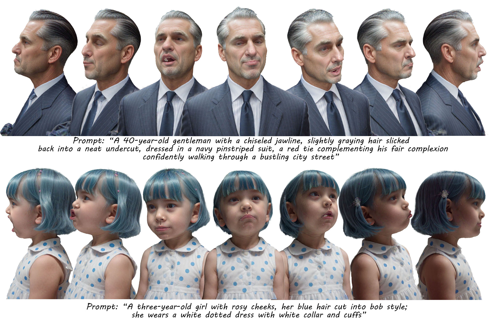

# AnimPortrait3D 

This is the official code repository for our SIG'25 paper:  
> **Text-based Animatable 3D Avatars with Morphable Model Alignment**
>
> **ACM SIGGRAPH 2025 (Conference Track)**
>
> [Yiqian Wu](https://onethousandwu.com/), [Malte Prinzler](https://malteprinzler.github.io/), [Xiaogang Jin*](http://www.cad.zju.edu.cn/home/jin), [Siyu Tang](https://inf.ethz.ch/people/person-detail.MjYyNzgw.TGlzdC8zMDQsLTg3NDc3NjI0MQ==.html)

<div align="center">

[![Project](https://img.shields.io/badge/AnimPortrait3D-1?label=Project&color=8B93FF&logo=data:image/svg+xml;charset=utf-8;base64,PHN2ZyB0PSIxNzEyNDkwMTA3NzIxIiBjbGFzcz0iaWNvbiIgdmlld0JveD0iMCAwIDEwMjkgMTAyNCIgdmVyc2lvbj0iMS4xIiB4bWxucz0iaHR0cDovL3d3dy53My5vcmcvMjAwMC9zdmciIHAtaWQ9IjM4NzUiIHdpZHRoPSIyMDAiIGhlaWdodD0iMjAwIj48cGF0aCBkPSJNMTAwMS40MjMyMzggNDk0LjU5MnEyMS41MDQgMjAuNDggMjIuNTI4IDQ1LjA1NnQtMTYuMzg0IDQwLjk2cS0xOS40NTYgMTcuNDA4LTQ1LjA1NiAxNi4zODR0LTQwLjk2LTE0LjMzNnEtNS4xMi00LjA5Ni0zMS4yMzItMjguNjcydC02Mi40NjQtNTguODgtNzcuODI0LTczLjcyOC03OC4zMzYtNzQuMjQtNjMuNDg4LTYwLjQxNi0zMy43OTItMzEuNzQ0cS0zMi43NjgtMjkuNjk2LTY0LjUxMi0yOC42NzJ0LTYyLjQ2NCAyOC42NzJxLTEwLjI0IDkuMjE2LTM4LjQgMzUuMzI4dC02NS4wMjQgNjAuOTI4LTc3LjgyNCA3Mi43MDQtNzUuNzc2IDcwLjY1Ni01OS45MDQgNTUuODA4LTMwLjIwOCAyNy4xMzZxLTE1LjM2IDEyLjI4OC00MC45NiAxMy4zMTJ0LTQ0LjAzMi0xNS4zNnEtMjAuNDgtMTguNDMyLTE5LjQ1Ni00NC41NDR0MTcuNDA4LTQxLjQ3MnE2LjE0NC02LjE0NCAzNy44ODgtMzUuODR0NzUuNzc2LTcwLjY1NiA5NC43Mi04OC4wNjQgOTQuMjA4LTg4LjA2NCA3NC43NTItNzAuMTQ0IDM2LjM1Mi0zNC4zMDRxMzguOTEyLTM3Ljg4OCA4My45NjgtMzguNHQ3Ni44IDMwLjIwOHE2LjE0NCA1LjEyIDI1LjYgMjQuMDY0dDQ3LjYxNiA0Ni4wOCA2Mi45NzYgNjAuOTI4IDcwLjY1NiA2OC4wOTYgNzAuMTQ0IDY4LjA5NiA2Mi45NzYgNjAuOTI4IDQ4LjEyOCA0Ni41OTJ6TTQ0Ny40MzkyMzggMzQ2LjExMnEyNS42LTIzLjU1MiA2MS40NC0yNS4wODh0NjQuNTEyIDI1LjA4OHEzLjA3MiAzLjA3MiAxOC40MzIgMTcuNDA4bDM4LjkxMiAzNS44NHEyMi41MjggMjEuNTA0IDUwLjY4OCA0OC4xMjh0NTcuODU2IDUzLjI0OHE2OC42MDggNjMuNDg4IDE1My42IDE0Mi4zMzZsMCAxOTQuNTZxMCAyMi41MjgtMTYuODk2IDM5LjkzNnQtNDUuNTY4IDE4LjQzMmwtMTkzLjUzNiAwIDAtMTU4LjcycTAtMzMuNzkyLTMxLjc0NC0zMy43OTJsLTE5NS41ODQgMHEtMTcuNDA4IDAtMjQuMDY0IDEwLjI0dC02LjY1NiAyMy41NTJxMCA2LjE0NC0wLjUxMiAzMS4yMzJ0LTAuNTEyIDUzLjc2bDAgNzMuNzI4LTE4Ny4zOTIgMHEtMjkuNjk2IDAtNDcuMTA0LTEzLjMxMnQtMTcuNDA4LTM3Ljg4OGwwLTIwMy43NzZxODMuOTY4LTc2LjggMTUyLjU3Ni0xMzkuMjY0IDI4LjY3Mi0yNi42MjQgNTcuMzQ0LTUyLjczNnQ1Mi4yMjQtNDcuNjE2IDM5LjQyNC0zNi4zNTIgMTkuOTY4LTE4Ljk0NHoiIHAtaWQ9IjM4NzYiIGZpbGw9IiNmZmZmZmYiPjwvcGF0aD48L3N2Zz4=)](https://onethousandwu.com/animportrait3d.github.io/)
[-1?color=58A399&logo=data:image/svg+xml;charset=utf-8;base64,PHN2ZyB0PSIxNzEyNDkwMTQyMjM1IiBjbGFzcz0iaWNvbiIgdmlld0JveD0iMCAwIDEwMjQgMTAyNCIgdmVyc2lvbj0iMS4xIiB4bWxucz0iaHR0cDovL3d3dy53My5vcmcvMjAwMC9zdmciIHAtaWQ9IjU5MTQiIHdpZHRoPSIyMDAiIGhlaWdodD0iMjAwIj48cGF0aCBkPSJNODIzLjI5NiA2MC40MTZxNjUuNTM2IDAgOTkuMzI4IDM4LjR0MzMuNzkyIDkzLjY5NnY1NDMuNzQ0cTAgMjUuNi0yMS41MDQgNDYuMDhsLTE3MS4wMDggMTYzLjg0cS0xMy4zMTIgMTEuMjY0LTIyLjUyOCAxNC4zMzZ0LTIzLjU1MiAzLjA3MkgyNTguMDQ4cS0yMy41NTIgMC00Ny4xMDQtOS43Mjh0LTQxLjk4NC0yNy42NDgtMzAuMjA4LTQzLjAwOC0xMS43NzYtNTUuODA4di02MzQuODhxMC02MC40MTYgMzMuMjgtOTYuMjU2dDk0LjcyLTM1Ljg0aDU2OC4zMnogbS0yMTUuMDQgNjQyLjA0OHExMy4zMTIgMCAyMi41MjgtOS4yMTZUNjQwIDY3MC43MnEwLTE0LjMzNi05LjIxNi0yMy4wNHQtMjIuNTI4LTguNzA0SDI4Ny43NDRxLTEzLjMxMiAwLTIyLjUyOCA4LjcwNFQyNTYgNjcwLjcycTAgMTMuMzEyIDkuMjE2IDIyLjUyOHQyMi41MjggOS4yMTZoMzIwLjUxMnogbTEyOC0xOTIuNTEycTEzLjMxMiAwIDIyLjUyOC05LjIxNlQ3NjggNDc4LjIwOHQtOS4yMTYtMjIuNTI4LTIyLjUyOC05LjIxNkgyODcuNzQ0cS0xMy4zMTIgMC0yMi41MjggOS4yMTZUMjU2IDQ3OC4yMDh0OS4yMTYgMjIuNTI4IDIyLjUyOCA5LjIxNmg0NDguNTEyeiBtNjMuNDg4LTE5MS40ODhxMTMuMzEyIDAgMjIuNTI4LTkuMjE2dDkuMjE2LTIzLjU1MnEwLTEzLjMxMi05LjIxNi0yMi41Mjh0LTIyLjUyOC05LjIxNmgtNTEycS0xMy4zMTIgMC0yMi41MjggOS4yMTZUMjU2IDI4NS42OTZxMCAxNC4zMzYgOS4yMTYgMjMuNTUydDIyLjUyOCA5LjIxNmg1MTJ6IiBwLWlkPSI1OTE1IiBmaWxsPSIjZmZmZmZmIj48L3BhdGg+PC9zdmc+)]( )
[]( )
[![Supp](https://img.shields.io/badge/Supplementary-1?color=378CE7&logo=data:image/svg+xml;charset=utf-8;base64,PHN2ZyB0PSIxNzEyNDkwMTgyMzc1IiBjbGFzcz0iaWNvbiIgdmlld0JveD0iMCAwIDEwMjQgMTAyNCIgdmVyc2lvbj0iMS4xIiB4bWxucz0iaHR0cDovL3d3dy53My5vcmcvMjAwMC9zdmciIHAtaWQ9Ijg5MDIiIHdpZHRoPSIyMDAiIGhlaWdodD0iMjAwIj48cGF0aCBkPSJNNDg2LjQgNDA5LjZIMjgyLjE4NTE0M2E0MS4zOTg4NTcgNDEuMzk4ODU3IDAgMCAwLTQxLjc2NDU3MiA0MC45NmMwIDIyLjY3NDI4NiAxOC43MjQ1NzEgNDAuOTYgNDEuNzY0NTcyIDQwLjk2aDk2LjMyOTE0M2EzNjIuNzg4NTcxIDM2Mi43ODg1NzEgMCAwIDAtOTYuMzI5MTQzIDI0NS43NmMwIDk0LjU3MzcxNCAzNi42NDQ1NzEgMTgwLjUxNjU3MSA5Ni4zMjkxNDMgMjQ1Ljc2SDE1Ni43NDUxNDNBODIuNzk3NzE0IDgyLjc5NzcxNCAwIDAgMSA3My4xNDI4NTcgOTAxLjEyVjgxLjkyQzczLjE0Mjg1NyAzNi42NDQ1NzEgMTEwLjU5MiAwIDE1Ni43NDUxNDMgMGg2NjguNzQ1MTQzYzQ2LjA4IDAgODMuNjAyMjg2IDM2LjY0NDU3MSA4My42MDIyODUgODEuOTJ2MzgxLjE0NzQyOWEzODAuMTk2NTcxIDM4MC4xOTY1NzEgMCAwIDAtNDIyLjYxOTQyOC01My4zOTQyODZ6IG0yNTUuNDg4LTE2My44NGMwLTIyLjY3NDI4Ni0xOC43MjQ1NzEtNDAuOTYtNDEuODM3NzE0LTQwLjk2SDI4Mi4xMTJhNDEuMzk4ODU3IDQxLjM5ODg1NyAwIDAgMC00MS43NjQ1NzEgNDAuOTZjMCAyMi42NzQyODYgMTguNzI0NTcxIDQwLjk2IDQxLjc2NDU3MSA0MC45Nmg0MTcuOTM4Mjg2YzIzLjExMzE0MyAwIDQxLjgzNzcxNC0xOC4yODU3MTQgNDEuODM3NzE0LTQwLjk2ek02NTguMjg1NzE0IDQ1MC41NmMxNjEuNjQ1NzE0IDAgMjkyLjU3MTQyOSAxMjguMzY1NzE0IDI5Mi41NzE0MjkgMjg2LjcyUzgxOS45MzE0MjkgMTAyNCA2NTguMjg1NzE0IDEwMjRzLTI5Mi41NzE0MjktMTI4LjM2NTcxNC0yOTIuNTcxNDI4LTI4Ni43MiAxMzAuOTI1NzE0LTI4Ni43MiAyOTIuNTcxNDI4LTI4Ni43MnogbS0xMjUuMzY2ODU3IDMyNy42OGg4My42MDIyODZ2ODEuOTJjMCAyMi42NzQyODYgMTguNjUxNDI5IDQwLjk2IDQxLjc2NDU3MSA0MC45NiAyMy4xMTMxNDMgMCA0MS43NjQ1NzEtMTguMjg1NzE0IDQxLjc2NDU3Mi00MC45NnYtODEuOTJoODMuNjAyMjg1YzIzLjExMzE0MyAwIDQxLjgzNzcxNC0xOC4yODU3MTQgNDEuODM3NzE1LTQwLjk2IDAtMjIuNjc0Mjg2LTE4LjcyNDU3MS00MC45Ni00MS44Mzc3MTUtNDAuOTZINzAwLjA1MDI4NlY2MTQuNGMwLTIyLjY3NDI4Ni0xOC42NTE0MjktNDAuOTYtNDEuNzY0NTcyLTQwLjk2YTQxLjM5ODg1NyA0MS4zOTg4NTcgMCAwIDAtNDEuNzY0NTcxIDQwLjk2djgxLjkySDUzMi45MTg4NTdhNDEuMzk4ODU3IDQxLjM5ODg1NyAwIDAgMC00MS44Mzc3MTQgNDAuOTZjMCAyMi42NzQyODYgMTguNzI0NTcxIDQwLjk2IDQxLjgzNzcxNCA0MC45NnoiIGZpbGw9IiNmZmZmZmYiIHAtaWQ9Ijg5MDMiPjwvcGF0aD48L3N2Zz4=)](https://drive.google.com/file/d/1bt67uAtJyfh8ZAUw7fl7QvA0B5oyWZWe)


</div>


<div align="center">

[![Video](https://img.shields.io/badge/Video-1?color=E178C5&logo=data:image/svg+xml;charset=utf-8;base64,PHN2ZyB0PSIxNzEyNDkwMjU5OTgxIiBjbGFzcz0iaWNvbiIgdmlld0JveD0iMCAwIDEwMjQgMTAyNCIgdmVyc2lvbj0iMS4xIiB4bWxucz0iaHR0cDovL3d3dy53My5vcmcvMjAwMC9zdmciIHAtaWQ9IjEyOTE2IiBpZD0ibXhfbl8xNzEyNDkwMjU5OTgyIiB3aWR0aD0iMjAwIiBoZWlnaHQ9IjIwMCI+PHBhdGggZD0iTTYyMy4zMzAyOTE0ODQ0NDQ0IDIwMy44OTk4OTE0ODQ0NDQ0Mkg5Ny43NDc3NTI5NjAwMDAwMXMtODguMDI4NjAyNTk1NTU1NTUgMC04OC4wMjg2MDI1OTU1NTU1NSA4NS40Mzk1MjU1NDY2NjY2NnY0MzIuMzc1NzgyOTY4ODg4ODdjMCA4NS40Mzk1MjU1NDY2NjY2NiA4OC4wMjg2MDI1OTU1NTU1NSA4NS40Mzk1MjU1NDY2NjY2NiA4OC4wMjg2MDI1OTU1NTU1NSA4NS40Mzk1MjU1NDY2NjY2Nmg1MjUuNTgyNTM4NTI0NDQ0NHM4OC4wMjg2MDI1OTU1NTU1NSAwIDg4LjAyODYwMjU5NTU1NTU1LTg1LjQzOTUyNTU0NjY2NjY2VjI5MS45Mjg0OTQwODAwMDAwNmMwLTg4LjAyODYwMjU5NTU1NTU1LTg4LjAyODYwMjU5NTU1NTU1LTg4LjAyODYwMjU5NTU1NTU1LTg4LjAyODYwMjU5NTU1NTU1LTg4LjAyODYwMjU5NTU1NTU1ek05ODMuMjExOTMwNzM3Nzc3OCAyNDcuOTE0MTkyMjEzMzMzM2MtNy43NjcyMzAwMDg4ODg4ODgtMi41ODkwNzcwNDg4ODg4ODg2LTE1LjUzNDQ1ODg3OTk5OTk5OS0yLjU4OTA3NzA0ODg4ODg4ODYtMjAuNzEyNjExODQgMi41ODkwNzcwNDg4ODg4ODg2bC0xNzMuNDY4MTI5MjggMTM0LjYzMTk4MDM3MzMzMzMzYy01LjE3ODE1Mjk2IDUuMTc4MTUyOTYtNy43NjcyMzAwMDg4ODg4ODggMTAuMzU2MzA1OTItNy43NjcyMjg4NzExMTExMTE1IDE1LjUzNDQ1ODg3OTk5OTk5OXYyMTQuODkzMzUyOTYwMDAwMDJjMCA1LjE3ODE1Mjk2IDIuNTg5MDc3MDQ4ODg4ODg4NiAxMi45NDUzODI5Njg4ODg4ODggNy43NjcyMjg4NzExMTExMTE1IDE1LjUzNDQ2MDAxNzc3Nzc3N2wxNzMuNDY4MTI5MjggMTM0LjYzMTk3OTIzNTU1NTU4YzIuNTg5MDc3MDQ4ODg4ODg4NiAyLjU4OTA3NzA0ODg4ODg4ODYgNy43NjcyMzAwMDg4ODg4ODggNS4xNzgxNTI5NiAxMi45NDUzODE4MzExMTExMTIgNS4xNzgxNTQwOTc3Nzc3NzcgMi41ODkwNzcwNDg4ODg4ODg2IDAgNS4xNzgxNTI5NiAwIDEwLjM1NjMwNzA1Nzc3Nzc3OC0yLjU4OTA3NzA0ODg4ODg4ODYgNy43NjcyMzAwMDg4ODg4ODgtMi41ODkwNzcwNDg4ODg4ODg2IDEwLjM1NjMwNTkyLTEwLjM1NjMwNTkyIDEwLjM1NjMwNTkyLTE4LjEyMzUzNTkyODg4ODg4OFYyNjYuMDM3NzI4MTQyMjIyMjVjMC03Ljc2NzIzMDAwODg4ODg4OC01LjE3ODE1Mjk2LTE1LjUzNDQ1ODg3OTk5OTk5OS0xMi45NDUzODI5Njg4ODg4ODgtMTguMTIzNTM1OTI4ODg4ODg4eiIgZmlsbD0iI2ZmZmZmZiIgcC1pZD0iMTI5MTciPjwvcGF0aD48L3N2Zz4=)](https://youtu.be/UgNcuUKAc7A)
[](https://github.com/oneThousand1000/AnimPortrait3D)
[](https://huggingface.co/datasets/onethousand/AnimPortrait3D_gallery)

</div>

 


We are currently working on the final check for the code, will be released in this month :)!


https://github.com/user-attachments/assets/fe1417cb-6769-47d3-a286-74d41c1829d9


## Contact

[onethousand1250@gmail.com](mailto:onethousand1250@gmail.com)


## Citation

If you find this project helpful to your research, please consider citing:

```
@article{AnimPortrait3D_sig25,
author = {Wu, Yiqian and Prinzler, Malte and Jin, Xiaogang and Tang, Siyun},
title = {Text-based Animatable 3D Avatars with Morphable Model Alignment},
year = {2025}, 
isbn = {},
publisher = {Association for Computing Machinery},
address = {New York, NY, USA},
url = {},
doi = {},
articleno = {},
numpages = {},
location = {Vancouver, BC, Canada},
series = {SIGGRAPH '25}
}
```


## Acknowledgements
We want to express our thanks to those in the open-source community for their valuable contributions.


 
## Usage Limitations Reminder

This project incorporates modified versions of the following projects:

- [gaussian-splatting](https://github.com/graphdeco-inria/gaussian-splatting)
- [GaussianAvatars](https://github.com/ShenhanQian/GaussianAvatars)
- [pytorch-hair-segmentation](https://github.com/YBIGTA/pytorch-hair-segmentation)
- [Unique3D](https://github.com/AiuniAI/Unique3D)
- [LucidDreamer](https://github.com/EnVision-Research/LucidDreamer)

Please note the following limitations:

1. The project is provided strictly for non-commercial research and evaluation purposes.
2. All original copyright, patent, trademark, and attribution notices must remain intact.

By using or distributing this project, you agree to comply with the licensing conditions specified by each of the above projects.

 